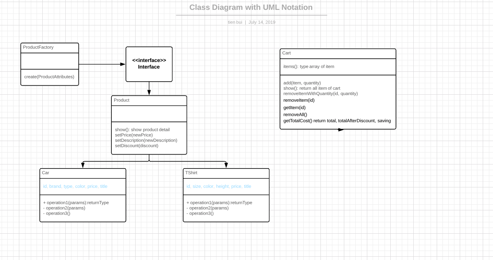

# OOP Shopoing Cart
This is a small project which I wrote by Javascript and use design pattern: Singleton and Factory.
This project run on Node and use command line to interact with

# How to start

```bash
npm run start
```

# Testing 

```bash
npm install jest
npm run test
```

# Class diagram

